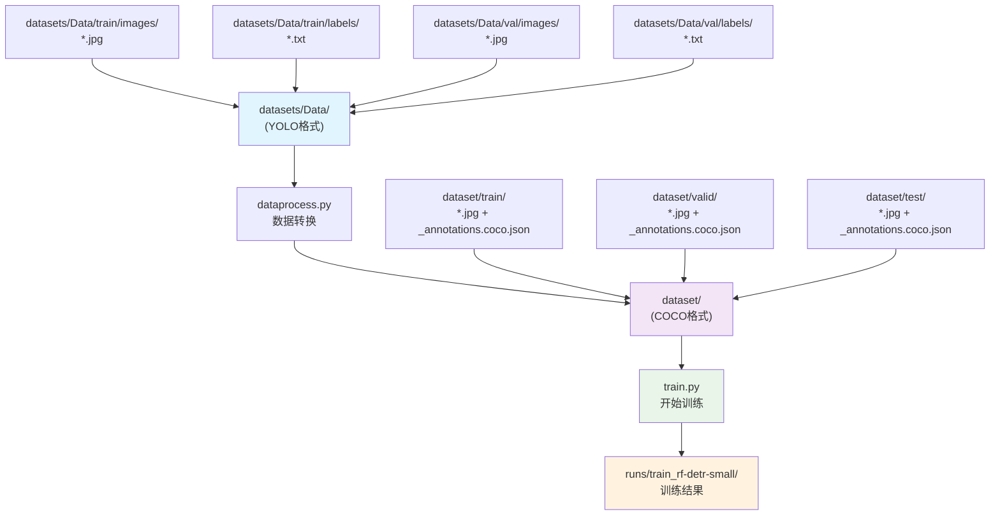

# RF-DETR训练使用说明

## 概述

本项目提供了简化的RF-DETR训练代码，仿照YOLO训练代码结构，针对RTX5060 8G显存和R9-8940 CPU优化配置。

## 硬件配置优化

### 您的硬件配置
- **CPU**: AMD R9-8940 (高性能处理器)  
- **GPU**: RTX5060 8G显存 (中等显存容量)
- **设备**: 天选6pro

### 针对您硬件的优化配置
- **batch_size**: 4 (适合8G显存)
- **grad_accum_steps**: 2 (等效batch_size=8) 
- **num_workers**: 8 (充分利用R9-8940多核性能)
- **SGD优化器**: lr=0.01, weight_decay=1e-4

## 文件说明

### 核心文件

1. **`dataprocess.py`** - 数据格式转换脚本
   - 将YOLO格式数据集转换为RF-DETR需要的COCO格式
   - 自动处理图像路径和边界框坐标转换

2. **`train.py`** - 简化训练脚本 (主要文件)
   - 仿照YOLO训练代码结构
   - 100轮训练，针对硬件优化

3. **`pth_to_pt.py`** - 模型格式转换脚本
   - 将训练好的.pth格式转换为.pt格式
   - 支持单文件和批量转换

4. **`infer.py`** - 模型推理测试脚本
   - 验证训练好的模型检测能力
   - 支持单张图像检测和结果可视化

## 项目目录结构

训练完成后，项目目录结构如下：
```
RF-DETR/
├── datasets/           # 原始YOLO数据集
│   └── Data/
├── dataset/           # 转换后的COCO格式数据集
├── runs/              # 训练结果目录
│   └── train_rf-detr-small/
│       ├── checkpoint_best_regular.pth    # 最佳常规模型
│       ├── checkpoint_best_ema.pth        # 最佳EMA模型
│       ├── checkpoint.pth                 # 最新检查点
│       ├── metrics_plot.png              # 训练指标图
│       └── log.txt                       # 训练日志
├── train.py           # 训练脚本 (已优化精度)
├── infer.py           # 推理脚本 (通用化)
├── dataprocess.py     # 数据转换脚本 (自动读取类别)
└── pth_to_pt.py       # 模型格式转换脚本
```

> **📝 注意**: 推理脚本(`infer.py`)和转换工具(`pth_to_pt.py`)会自动搜索训练模型：
> - 优先查找新的`runs/train_rf-detr-small/`目录
> - 向后兼容旧的`output/`目录结构

## ✨ 新功能特性

### 🔧 通用化改进
- **自动适应任何数据集**: 不再局限于垃圾分类
- **智能类别识别**: 自动从data.yaml读取类别名称
- **动态推理**: 推理工具自动适配训练的类别数量

### 📊 训练代码优化 (基于官方代码)
- **RFDETRSmall模型**: 比官方RFDETRBase精度更高
- **学习率平衡**: 2e-4，基于官方1e-4适度提升
- **硬件优化**: 有效batch_size=16，适配8G显存
- **简洁高效**: 遵循官方代码风格，去除冗余参数

## 快速开始

### 1. 环境准备
确保已安装：
```bash
pip install torch torchvision rfdetr pillow pyyaml
```

### 2. 数据集准备
确保YOLO数据集结构如下：
```
datasets/
└── Data/
    ├── train/
    │   ├── images/     # JPG图像文件
    │   └── labels/     # YOLO格式标注文件
    ├── val/
    │   ├── images/
    │   └── labels/
    └── test/           # 可选，如果没有会自动复制val数据
        ├── images/
        └── labels/
```

转换后将生成COCO格式：
```
dataset/
├── train/
│   ├── _annotations.coco.json
│   ├── image1.jpg
│   └── image2.jpg
├── valid/
│   ├── _annotations.coco.json
│   ├── image1.jpg
│   └── image2.jpg
└── test/
    ├── _annotations.coco.json  # 原始test或复制valid集数据
    ├── image1.jpg
    └── image2.jpg
```

### 3. 训练流程



### 4. 开始训练
```bash
cd RF-DETR

# 第一步：转换数据格式
python dataprocess.py

# 第二步：开始训练
python train.py
```

### 5. 模型推理测试 (训练完成后)
训练完成后，可以测试模型的检测能力：

**准备测试图像：**
```bash
# 将您的测试图像重命名为test1.jpg并放在RF-DETR目录下
# 或者使用系统自带的示例图像
```

**运行推理测试：**
```bash
python infer.py
# 自动加载训练好的模型，对test1.jpg进行检测
# 生成detection_result.jpg查看检测结果
```

### 6. 模型格式转换 (可选)
训练完成后，可以将.pth格式转换为.pt格式：

**快速转换模式：** ⭐推荐
```bash
python pth_to_pt.py
# 自动检测训练目录中的模型文件，选择转换
```

**命令行转换：**
```bash
# 转换最佳模型
python pth_to_pt.py runs/train_rf-detr-small/checkpoint_best_regular.pth -o final_model.pt

# 转换EMA模型  
python pth_to_pt.py runs/train_rf-detr-small/checkpoint_best_ema.pth -o final_model_ema.pt

# 批量转换训练目录
python pth_to_pt.py runs/train_rf-detr-small/ --batch
```

## 训练参数说明

### 主要参数（在train.py中可调整）

**📈 基于官方代码优化版本参数：**
- **模型**: RFDETRSmall (比官方RFDETRBase精度更高) 🆕
- **epochs**: 100轮训练
- **batch_size**: 4 (适合8G显存)
- **grad_accum_steps**: 4 (等效batch_size=16)
- **lr**: 2e-4 (基于官方1e-4适度提升)
- **output_dir**: 'runs/train_rf-detr-small'

**💡 优化要点：**
- 基于RF-DETR官方代码风格
- 使用更高精度的Small模型
- 平衡的学习率设置(2e-4)
- 简洁高效的参数配置

## 训练监控

训练过程会显示：
- 当前epoch进度
- 训练损失
- 验证mAP
- 学习率
- 每轮耗时

模型自动保存在`runs/train_rf-detr-small`目录。

## 性能预期

### 基于您的硬件 (RTX5060 8G + R9-8940)
- **每轮训练**: 约2-3分钟
- **100轮总时间**: 约3-5小时
- **显存占用**: 约6-7GB

## 常见问题

### Q: 显存不足怎么办？
修改train.py中的batch_size：
```python
batch_size=2,               # 从4改为2
grad_accum_steps=4,         # 从2改为4
```

### Q: 数据格式转换失败？
检查：
- 确保datasets/Data/train和datasets/Data/val目录存在
- 确保images和labels子目录都有文件
- 标注格式：类别ID x_center y_center width height

### Q: 想调整训练参数？
直接修改train.py文件中的参数即可。

### Q: 如何测试训练好的模型？
使用infer.py脚本：
```bash
# 准备测试图像test1.jpg，然后运行
python infer.py
# 查看detection_result.jpg获得检测结果
```

### Q: 如何转换模型格式？
使用pth_to_pt.py脚本：
```bash
# 快速转换模式（推荐）
python pth_to_pt.py
# 自动扫描训练目录，选择要转换的模型

# 手动转换最佳模型
python pth_to_pt.py runs/train_rf-detr-small/checkpoint_best_regular.pth -o my_model.pt

# 转换EMA模型
python pth_to_pt.py runs/train_rf-detr-small/checkpoint_best_ema.pth -o my_model_ema.pt
```

## 与YOLO对比

| 参数 | YOLO | RF-DETR |
|------|------|---------|
| epochs | 150 | 100 |
| batch | 12 | 4 |
| workers | 16 | 8 |

祝训练顺利！🚀